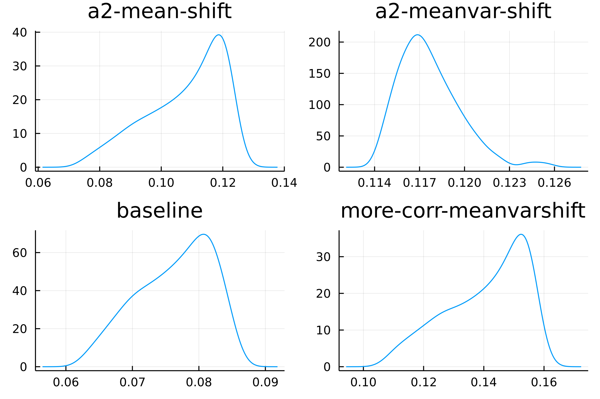
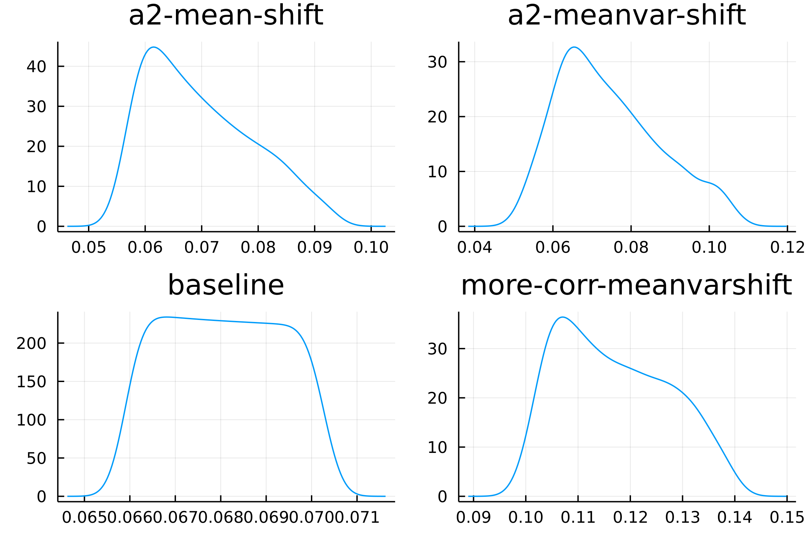
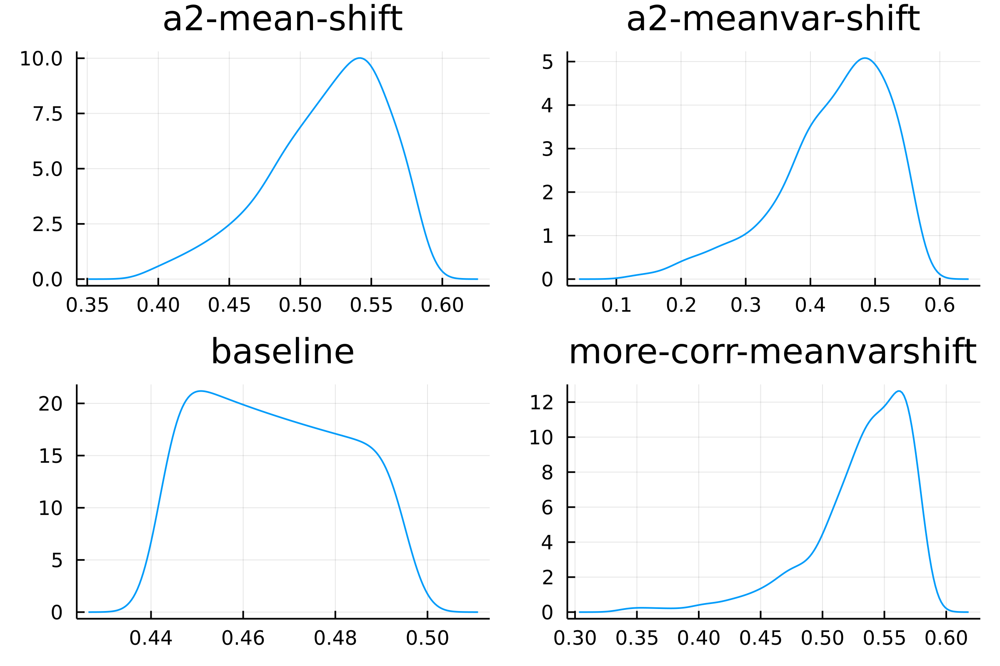
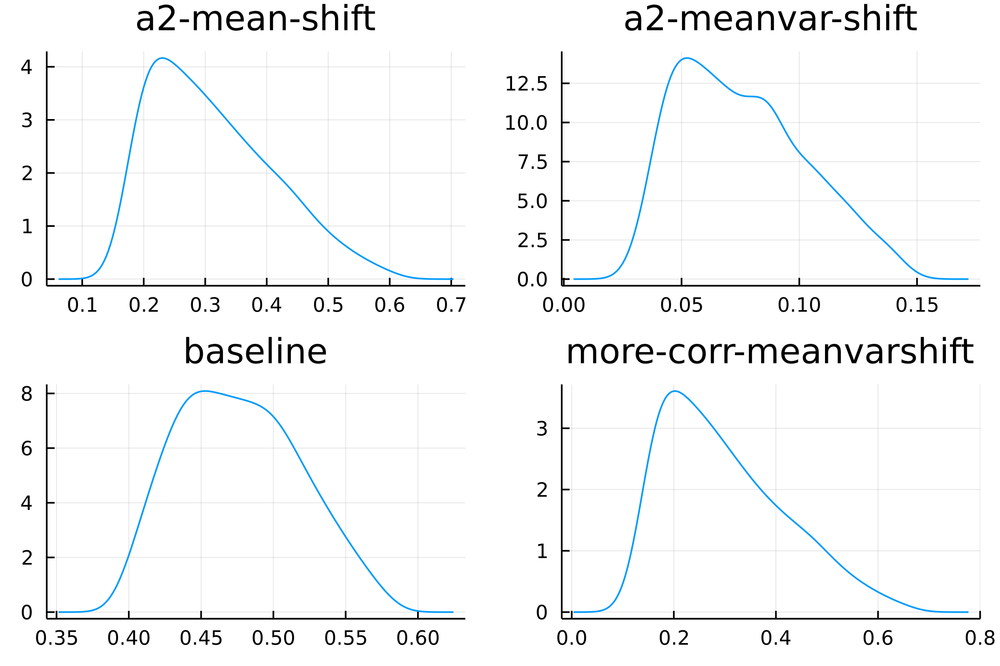

Some plots:

# Identities

$$
q^*_j = \frac{1}{\rho}\big(\hat s_j \hat \Sigma_{H,j} + (1-\hat s_j) \hat \Sigma_{L,j}\big)^{-1}\big(\hat s_j \hat \mu_{H,j} + (1-\hat s_j) \hat \mu_{L,j} - pr \big)
$$

# Priors

50 by 50 grid, 1k investors, $K=10$.

Baseline prior:

Mean shift:

Correlated mean shift:

Mean \& Variance shift:

# Joint pricing restriction:

Piecewise solve for

$$
p = A + B f + C \overline x
$$

A2 price, baseline

A2 price, mean/var shift

A2 own-price coefficient, baseline

A2 own-price coefficient, mean/var shift

Disagreement, baseline

Disagreement, mean/var shift

Entropy, baseline

Entropy, mean/var shift

# Coefficient marginals

Intercept, asset 1

Intercept, asset 2

Own-price, asset 1

Own-price, asset 2

Cross-price

